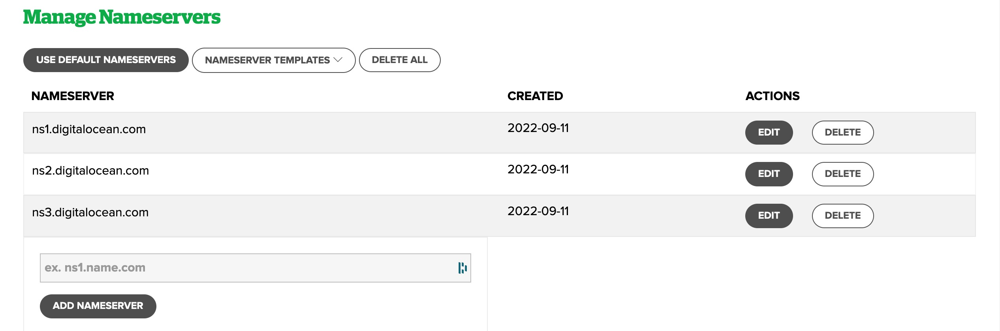
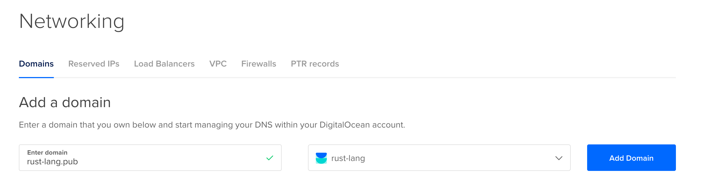
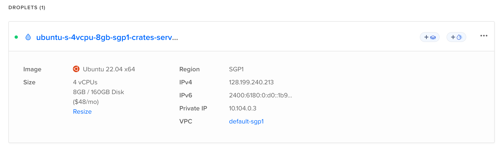
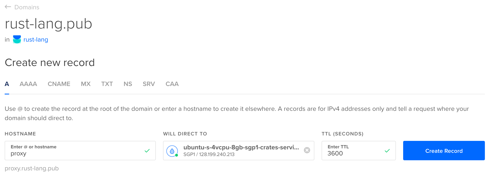
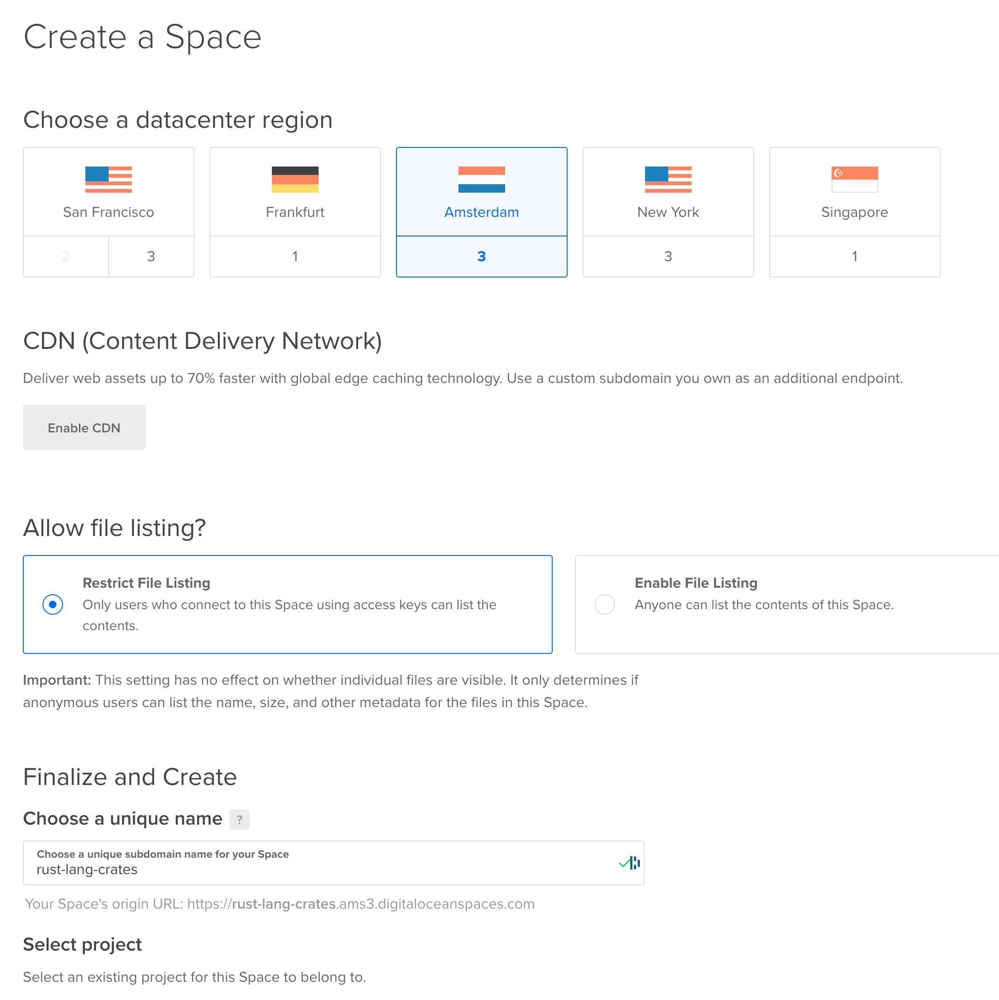
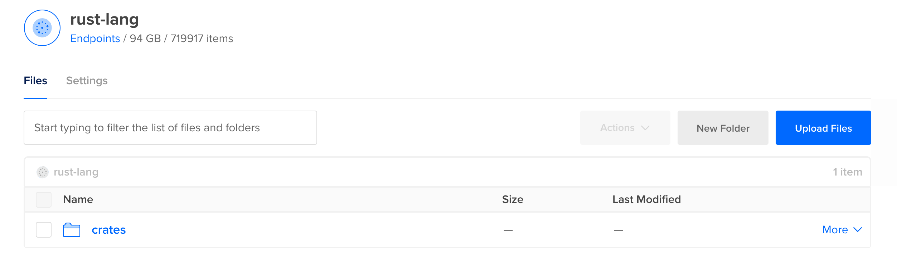
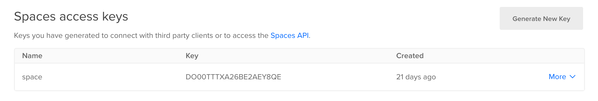

## Building the Proxy of Crates Index With Node.js

In Rust, the crates index is a git [repository](https://github.com/rust-lang/crates.io-index). When the developer complies Rust project, the cargo download crates index from [GitHub](https://github.com) and crate files from [registry](https://crates.io). The crates index is a large repository, and it is not easy to download it from the remote. So, I wrote this project of building a proxy of crates index with Nodejs and [pipy](https://flomesh.io).

First, I want to build the proxy of crates with Rust, but I could not find details about how to do or the dataflow between crates.io and cargo. So, I write the simple project with Nodejs for learning and testing.

The project is not for production, it's for learning the crates index mechanism. The project is not perfect, and it has many bugs. If you have any questions, please submit an issue.

### How to Deploy the Proxy of Crates Index

#### 1. Prepare a domain name

1. Buy a domain from [name.com](https://name.com), I already had **rust-lang.pub**, and use **proxy.rust-lang.pub** as proxy domain.
2. Change the nameservers of **rust-lang.pub** to the [DigitalOcean](https://m.do.co/c/bbf00c247f50)'s domains nameservers (`ns1.digitalocean.com`, `ns2.digitalocean.com` and `ns3.digitalocean.com`).
   
3. Add **rust-lang.pub** to the [DigitalOcean](https://m.do.co/c/bbf00c247f50)'s domains in the **Networking -> Domains** tab.
   

#### 2. Prepare a Proxy Server

1. Create a droplet from [DigitalOcean](https://m.do.co/c/bbf00c247f50). I chose a droplet with 8GB memory and 4 CPUs located in Singapore, and the droplet is running Ubuntu 22.04.
   > Please note that the droplet use the **root** user.
   
2. Installed [Rust](https://rust-lang.org), [Golang](https://golang.dev), [Node.js](https://nodejs.org/en/) and [pipy](https://flomesh.io) on the droplet.
   ```bash
   $ # Install dependencies packages
   $ apt install clang make cmake libssl-dev pkg-config vim-nox
   $ # Install Rust
   $ curl --proto '=https' --tlsv1.2 -sSf https://sh.rustup.rs | sh
   $ # Install Golang 
   $ wget https://golang.org/dl/go1.19.1.linux-amd64.tar.gz
   $ tar -xzvf go1.19.1.linux-amd64.tar.gz
   $ rm go1.19.1.linux-amd64.tar.gz
   $ # Install Node.js
   $ wget https://nodejs.org/dist/v18.10.0/node-v18.10.0-linux-x64.tar.xz
   $ xz -d node-v18.10.0-linux-x64.tar.xz
   $ tar -xvf node-v18.10.0-linux-x64.tar
   $ mv node-v18.10.0-linux-x64 node && rm node-v18.10.0-linux-x64.tar
   $ # Add the path to the environment variable
   $ echo "export PATH=$PATH:/root/go/bin:/root/node/bin" >> ~/.bashrc
   $ # Build and install pipy
   $ git clone https://github.com/flomesh-io/pipy.git
   $ cd pipy
   $ ./build.sh
   $ cp ./bin/* /usr/local/bin
   ```
#### 3. Prepare the domain and certificates

1. Add a subdomain like **proxy.rust-lang.pub** direct to the droplet in the **Networking -> Domains -> rust-lang.pub -> crate new record** tab.
   
2. Install [certbot](https://certbot.eff.org) on the droplet, and get the certificates.
   ```bash
   $ snap install --classic certbot
   $ ln -s /snap/bin/certbot /usr/bin/certbot
   $ snap set certbot trust-plugin-with-root=ok
   $ snap install certbot-dns-digitalocean
   $ # Add a token file in $HOME/.secrets/certbot/digitalocean.ini, and the file content is:
   $ # dns_digitalocean_token = <your digitalocean token>
   $ # The token can be generate in the DigitalOcean -> API -> Tokens
   $ # Get the certificates
   $ chmod 400 $HOME/.secrets/certbot/digitalocean.ini
   $ certbot certonly --dns-digitalocean --dns-digitalocean-credentials ~/.secrets/certbot/digitalocean.ini -d rust-lang.pub -d '*.rust-lang.pub'
   Saving debug log to /var/log/letsencrypt/letsencrypt.log
   Enter email address (used for urgent renewal and security notices)
   (Enter 'c' to cancel): eli@patch.sh

   - - - - - - - - - - - - - - - - - - - - - - - - - - - - - - - - - - - - - - - -
   Please read the Terms of Service at
   https://letsencrypt.org/documents/LE-SA-v1.3-September-21-2022.pdf. You must
   agree in order to register with the ACME server. Do you agree?
   - - - - - - - - - - - - - - - - - - - - - - - - - - - - - - - - - - - - - - - -
   (Y)es/(N)o: Y

   - - - - - - - - - - - - - - - - - - - - - - - - - - - - - - - - - - - - - - - -
   Would you be willing, once your first certificate is successfully issued, to
   share your email address with the Electronic Frontier Foundation, a founding
   partner of the Let's Encrypt project and the non-profit organization that
   develops Certbot? We'd like to send you email about our work encrypting the web,
   EFF news, campaigns, and ways to support digital freedom.
   - - - - - - - - - - - - - - - - - - - - - - - - - - - - - - - - - - - - - - - -
   (Y)es/(N)o: Y
   Account registered.
   Requesting a certificate for rust-lang.pub and *.rust-lang.pub
   Waiting 10 seconds for DNS changes to propagate

   Successfully received certificate.
   Certificate is saved at: /etc/letsencrypt/live/rust-lang.pub/fullchain.pem
   Key is saved at:         /etc/letsencrypt/live/rust-lang.pub/privkey.pem
   This certificate expires on 2023-01-11.
   These files will be updated when the certificate renews.
   Certbot has set up a scheduled task to automatically renew this certificate in the background.

   - - - - - - - - - - - - - - - - - - - - - - - - - - - - - - - - - - - - - - - -
   If you like Certbot, please consider supporting our work by:
   * Donating to ISRG / Let's Encrypt:   https://letsencrypt.org/donate
   * Donating to EFF:                    https://eff.org/donate-le
   - - - - - - - - - - - - - - - - - - - - - - - - - - - - - - - - - - - - - - - -
   ```

#### 4. Prepare the index of crates

1. Clone the crates index repository.
   ```bash
   $ mkdir /opt/rust
   $ cd /opt/rust && git clone https://github.com/rust-lang/crates.io-index.git
   ```
2. Create a cron script named `cron-pull-crates-index.sh` to update the crates index repository.
   ```shell
   #!/bin/bash
   
   cd /opt/rust/crates.io-index || exit
   git fetch origin
   git merge origin/master --no-edit
   git prune
   
   exit 0
   ```
3. Add the cron job to the crontab.
   ```bash
   $ crontab -e
   $ # Add the following line to the crontab file
   $ */1 * * * * /bin/bash /opt/rust/proxy/cron/cron-pull-crates-index.sh
   ```
4. Restart the cron service.
   ```bash
   $ systemctl restart cron
   $ systemctl enable cron
   ```
5. View cron logs.
   ```bash
   $ tail -f /var/log/syslog
   ```
   
#### 5. Run the git http backend server

1. Clone the project to the droplet.
   ```bash
   $ screen
   $ cd /opt/rust && git clone https://github.com/genedna/crates-index-proxy.git
   $ cd crates-index-proxy && node crates-index-proxy.js
   ```

#### 6. Run the pipy server

1. Configured the [pipy](https://flomesh.io) to proxy the domain **proxy.rust-lang.pub**.
   ```javascript
   pipy()
       .listen('128.199.81.204:80')
       .demuxHTTP().to(
           $ => $.muxHTTP().to(
               $ => $.connect('localhost:6789')
           )
       )
   
       .listen('[2400:6180:0:d0::7d:9001]:80')
           .demuxHTTP().to(
           $ => $.muxHTTP().to(
               $ => $.connect('localhost:6789')
           )
       )
   
       .listen('128.199.81.204:443')
       .link('req')
   
       .listen('[2400:6180:0:d0::7d:9001]:443')
       .link('req')
   
       .pipeline('req')
       .acceptTLS({
           certificate: {
               cert: new crypto.CertificateChain(os.readFile('/etc/letsencrypt/live/rust-lang.pub/fullchain.pem')),
               key: new crypto.PrivateKey(os.readFile('/etc/letsencrypt/live/rust-lang.pub/privkey.pem')),
           }
       }).to('inbound-http')
   
       .pipeline('inbound-http')
       .demuxHTTP().to(
           $ => $.muxHTTP().to(
               $ => $.connect('localhost:6789')
           )
       )
   ```

2. Run pipy for reserving the proxy of crates index.
   ```bash
   $ screen
   $ pipy proxy.js
   ```
3. Test the proxy with `git` command
   ```bash
   $ git clone https://proxy.rust-lang.pub/crates.io-index.git
   ```
4. Update local cargo config file.
   ```toml
   [source.crates-io]
   replace-with = 'rustpub'
   
   [source.rustpub]
   registry = "https://proxy.rust-lang.pub/crates.io-index"
   
   [registries.rustpub]
   index = "https://proxy.rust-lang.pub/crates.io-index"
   ```
> For now, you already have a crates index proxy server, you could use it to speed up the `cargo build` command or deploy it to your local development environment.

### Cache the crates index and crate files at the same time

If you want to cache the crate files to speed up, you should use [Freighter](https://github.com/open-rust-initiative/freighter) to cache the crates index and crate files at the same time.

#### 1. Management DigitalOcean Space with s3cmd

You can use local filesystem to cache the crates files or use Object Storage Service like DigitalOcean Space to do. Almost all the Object Storage Service support the S3 protocol, so you can use [s3cmd](https://s3tools.org/s3cmd) to manage the Object Storage Service.

1. Create a bucket in DigitalOcean Space.
   
2. Create a folder `crates` in space.
   
3. Generate a Space Access Key and Secret Key and remember it.
   
4. Install `s3cmd` on the droplet.
   ```shell
   $ apt install s3cmd
   ```
5. Configure `s3cmd` with the DigitalOcean Space.
   ```shell
   $ s3cmd --configure
   Enter new values or accept defaults in brackets with Enter.
   Refer to user manual for detailed description of all options.

   Access key and Secret key are your identifiers for Amazon S3. Leave them empty for using the env variables.
   Access Key: Your DigitalOcean Space Access Key
   Secret Key: Your DigitalOcean Space Secret Key
   Default Region [US]:

   Use "s3.amazonaws.com" for S3 Endpoint and not modify it to the target Amazon S3.
   S3 Endpoint: sgp1.digitaloceanspaces.com

   Use "%(bucket)s.s3.amazonaws.com" to the target Amazon S3. "%(bucket)s" and "%(location)s" vars can be used
   if the target S3 system supports dns based buckets.
   DNS-style bucket+hostname:port template for accessing a bucket: %(bucket)s.sgp1.digitaloceanspaces.com

   Encryption password is used to protect your files from reading
   by unauthorized persons while in transfer to S3
   Encryption password:
   Path to GPG program [/opt/homebrew/bin/gpg]:

   When using secure HTTPS protocol all communication with Amazon S3
   servers is protected from 3rd party eavesdropping. This method is
   slower than plain HTTP, and can only be proxied with Python 2.7 or newer
   Use HTTPS protocol [Yes]:

   On some networks all internet access must go through a HTTP proxy.
   Try setting it here if you can't connect to S3 directly
   HTTP Proxy server name [127.0.0.1]:
   HTTP Proxy server port [7890]:

   New settings:
   Access Key: Your DigitalOcean Space Access Key
   Secret Key: Your DigitalOcean Space Secret Key
   Default Region: US
   S3 Endpoint: sgp1.digitaloceanspaces.com
   DNS-style bucket+hostname:port template for accessing a bucket: %(bucket)s.sgp1.digitaloceanspaces.com
   Encryption password:
   Path to GPG program: /opt/homebrew/bin/gpg
   Use HTTPS protocol: True
   HTTP Proxy server name: 127.0.0.1
   HTTP Proxy server port: 7890

   Test access with supplied credentials? [Y/n]
   Please wait, attempting to list all buckets...
   Success. Your access key and secret key worked fine :-)

   Now verifying that encryption works...
   Not configured. Never mind.

   Save settings? [y/N] y
   Configuration saved to '/Users/eli/.s3cfg'
   ```

#### 2. Advanced: Sync crates.io-index and crate files with Freighter

Now [we](https://github.com/open-rust-Initiative) are working on a __pure__ Rust registry projects named [Freighter](https://github.com/open-rust-Initiative/freighter). The first version of Freighter focuses on syncing the crates.io-index and crate files to build proxy function.

1. Clone the project to the droplet and build.
   ```bash
   $ git clone https://github.com/open-rust-Initiative/freighter.git
   $ cd freighter
   $ cargo build --release
   $ cp ./target/release/freighter /usr/local/bin
   ```

2. Sync the crates.io-index with Freighter.
   ```bash
   $ freighter sync pull && freighter sync -t 128 -c /opt/rust download --init
   ```

3. Sync the crates files with Freighter.
   ```bash
   $ crontab -e
   $ # Add the following line to the crontab file
   $ */1 * * * * freighter sync pull && freighter sync -t 256 -c /opt/rust download
   ```

### TODO List

  * [ ] Cache the crate files from the crates.io.
  * [ ] Upload the crate files to the DigitalOcean Spaces.
  * [ ] Rewrite the `config.json` of index repository to use the DigitalOcean Spaces.

### LICENSE

[MIT](LICENSE) 

### Host and Space Powered By

[](https://www.digitalocean.com/?refcode=bbf00c247f50&utm_campaign=Referral_Invite&utm_medium=Referral_Program&utm_source=badge)